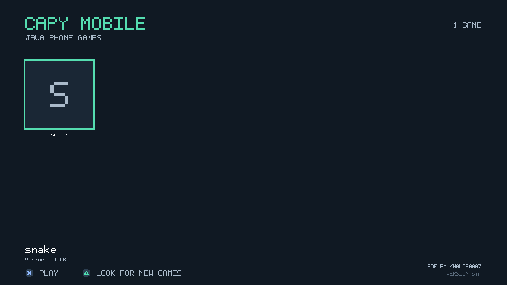
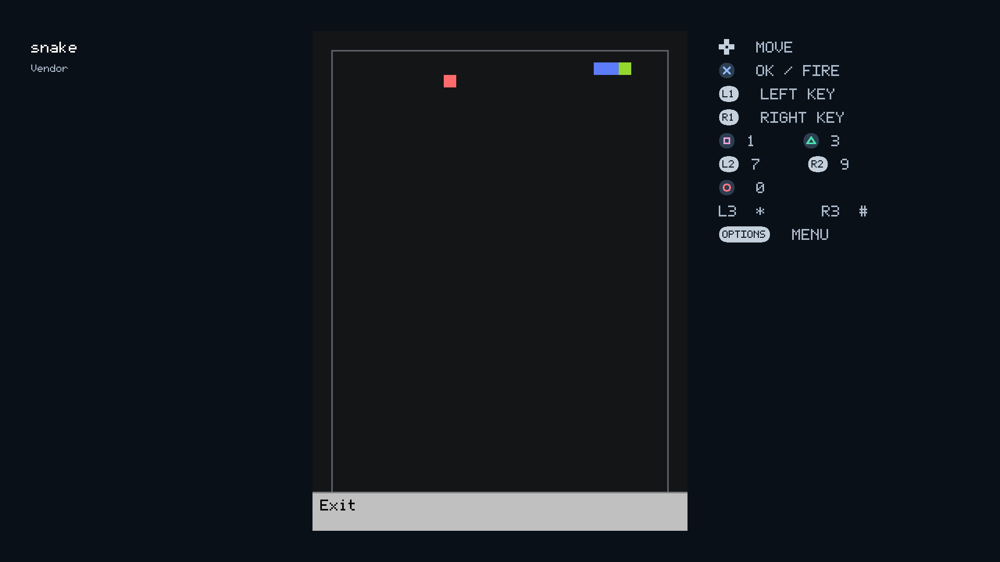
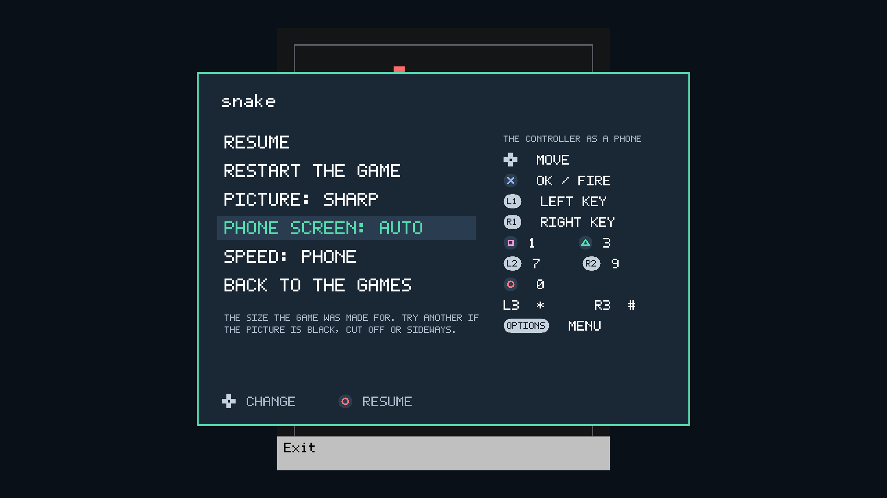

# Capy Mobile

Java phone games on the PS5.

Capy Mobile is a native PS5 homebrew app that runs J2ME games: the `.jar` games of Nokia, Sony Ericsson
and other phones from about 2002 to 2011. It has its own icon on the home screen, a list of your games,
and the DualSense standing in for the phone's keys.





It is built on [noJMe](https://github.com/corax89/noJMe), an open-source J2ME emulator written in C,
and on [ps5-native-app-boilerplate](https://github.com/blackbearreloaded/ps5-native-app-boilerplate).
No Java is installed on the console. One small open-source game comes with it, so there is something
to play at once: [Snake](https://github.com/anasrar/java-me-snake) by Anas Rin (MIT), the game in the
pictures above. Everything else you add yourself.

## Status

Early, but it plays. It was developed and tried on one PS5 on system software 13.60.

- Works: the game list, sound, saves, the pause menu, a phone screen and speed chosen per game.
- Tried on the console: Bounce Tales (Nokia). Tried in the PC simulator: Assassin's Creed II (Gameloft).
- The engine is young. Some games will not start, and some need another phone screen (see below).
- Not there yet: touch-screen games, the keys 2, 4, 5, 6 and 8 as buttons of their own, and installing
  games from inside the app. Games are copied over FTP.

## What you need

- A jailbroken PS5 with **ShadowMount+** (it registers the app from `/data/homebrew`) and an **FTP
  server** such as ftpsrv. It was made on a console running kstuff and ShadowMount+ 1.7.
- Games, as `.jar` files. Only use games you have the right to use. Open-source ones exist: for
  example the 100 small games of [j2me-100-games](https://github.com/agneay/j2me-100-games) (MIT).

## Install

1. Download `CapyMobile-<version>.zip` from the releases, or build it (below).
2. Copy the folder `PPSA92280` from it to `/data/homebrew/` on the PS5 over FTP, so that
   `/data/homebrew/PPSA92280/eboot.bin` exists.
3. Close whatever game or app is running. ShadowMount+ looks for new apps only on the home screen, and
   the Capy Mobile icon appears within a minute.

With Python on your PC, `python deploy.py <PS5 address>` does step 2 for a build you made.

## Adding games

Copy `.jar` files into

```
/data/homebrew/PPSA92280/games
```

with any FTP program, or `python deploy.py <PS5 address> --games <folder or .jar>`. Then press
**Triangle** in Capy Mobile. A `.jad` file that came with a game is not needed.

Saves are in `/data/homebrew/PPSA92280/saves`, and the app's log is `capy-mobile.log` beside them.

## Controls

| Controller | Phone |
|---|---|
| D-pad, left stick | the arrows |
| Cross | OK / fire |
| L1, R1 | left and right soft keys |
| Square, Triangle | 1, 3 |
| L2, R2 | 7, 9 |
| Circle | 0 |
| L3, R3 | `*`, `#` |
| Options | the pause menu |

## When a game does not work

Open the pause menu with **Options**. What you choose there is remembered for that game.

- **Phone screen.** Every `.jar` was built for one screen size, and often for one way up. If the picture
  is black, cut off or sideways, or the game says to turn the phone, try another size with left and
  right; the game starts again on it. "Auto" is the size the game's own description names, else 240x320.
  When a game comes in several versions, the 240x320 one for phones with a keypad is the safest.
- **Speed.** "Phone" runs the game about as fast as a phone of its time. "Turbo" lets it run as fast as
  the console goes, which shortens long loading; some games then play too fast.
- **Picture.** "Sharp" enlarges by a whole number, "Full height" fills the screen's height.

If a game still fails, `capy-mobile.log` says what the engine made of it.

## Build

On Linux, or on Windows in WSL (Ubuntu 24.04 was used), with git, python3, clang-18, lld-18, ninja
and make:

```
bash build.sh
```

The first run fetches the PS5 toolchain and the engine into `.deps/`, each at a pinned commit, and the
toolchain downloads the open ps5-payload-sdk. The result is `dist/PPSA92280/` and a zip of it. The
version is `contentVersion` in `sce_sys/param.json`; `python make_icon.py` (Pillow) draws the icon.

## Try it on the PC

The app's own code runs on the PC with a scripted controller and saves screens as PNGs, which is how
it is checked without a console:

```
mkdir -p /tmp/home/games && cp games/snake.jar /tmp/home/games/
PORTED=1 bash tests/run.sh /tmp/shots /tmp/home "w20 s:list X w120 R w40 D w40 s:game OPT w10 s:menu"
```

`tests/sim.c` explains the script words. `PORTED=1` builds the engine exactly as the console gets it.

## How it is put together

- `src/app.c` is the app: the game list, the game on screen, the pause menu.
- `src/core.c` is a small libretro frontend for the one core it links, noJMe.
- `src/audio.c` brings the engine's sound to 48 kHz and plays it from a thread of its own.
- `src/ps5/` is what a PS5 title lacks and the engine needs: a heap of its own (the title's `malloc`
  is a small system heap), thread-local variables, a context switch for the engine's cooperative
  threads, and a few C library functions.
- `port_engine.py` fits a copy of the engine to the console's FreeBSD headers at build time. The engine
  itself is not changed and not included here.

Things learned on the way that may save others time are in [docs/NOTES.md](docs/NOTES.md).

## Credits

Made by **khalifa007**: [X / Twitter](https://x.com/Khalifa007_) · [GitHub](https://github.com/khalifa007)

It stands on other people's work:

- [noJMe](https://github.com/corax89/noJMe) by Corax89: the Java machine and the phone library.
- [ps5-native-app-boilerplate](https://github.com/blackbearreloaded/ps5-native-app-boilerplate) by
  BlackBearReloaded: the toolchain that makes a native PS5 title.
- [ps5-payload-sdk](https://github.com/ps5-payload-dev/sdk) by John Törnblom and contributors.
- Mihawk's [PS5_RetroArch](https://github.com/mihawk-99/PS5_RetroArch) and its platform notes, and
  Swordpdf's [PS5SX2](https://github.com/Swordpdf/PS5SX2), for showing what a PS5 title can and cannot do.
- Anas Rin's [Snake](https://github.com/anasrar/java-me-snake), the game that comes with the app.
- Doug Lea's allocator and Sean Barrett's stb_image_write (see [THIRD_PARTY.md](THIRD_PARTY.md)).

## Licence

Capy Mobile is free software under the GNU General Public License, version 3 or later (see
[LICENSE](LICENSE)). The engine and the toolchain it is built with are GPL-3.0 too, so anyone who is
given the app must be offered its source: this repository.

Copyright (C) 2026 khalifa007.

Capy Mobile is not affiliated with Sony, Nokia or any game publisher. Game names are their owners'.
